# 🎓 Learning Management System (LMS)

## 📌 Overview
A Django-based Learning Management System designed for managing students, teachers, courses, and enrollments.

---

# 🚀 Features

## 🔹 Student
- Register & Login
- Enroll in Courses
- Leave Reviews
- Watch Promo Videos
- View Course Details
- Inbox Messaging System
- Message Admin/Teachers
- Sent Messages
- View Enrolled Courses
- Save & Unsave Courses
- Save Courses / Wishlist
- View About Page
- Complete Lessons and Generate Certificates Instantly
- Track Course Applications
- Create & Update Profile
- Student Dashboard with:
  - Enrolled Courses
  - Saved Courses
  - Recommended Courses
  - Recent Activity
- Notifications with Mark as Read

---

## 🔹 Staff / Teacher
- Register & Login
- Create Courses
- Add Lessons
- Manage Applications
- Manage & Reply to Reviews
- Create & Update Profile
- Monitor:
  - Approved Applications
  - Pending Applications
  - Rejected Applications
- Wishlist / Saved Courses
- Compose Messages
- Inbox & Sent Messages

---

## 🔹 Admin
- Dashboard Statistics:
  - Total Users
  - Teachers
  - Students
  - Courses
  - Applications
- Pie Chart (Student vs Teacher)
- Bar Chart (Top Teachers by Courses Posted)
- Line Charts:
  - Applications over 7 Days
  - 30 Days
  - All Time
- Recent Applicants
- Recent Teachers
- User Management
- Teacher Management
- Course Management
- Application Management
- Messaging System

---

# 🛠️ Tech Stack
- Python
- Django
- Bootstrap
- SQLite

---
## 📸 Screenshots
## Homepage/Course listing
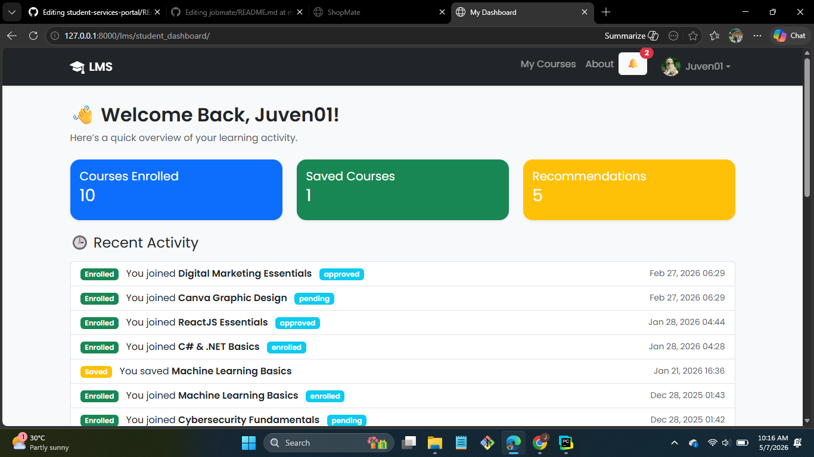
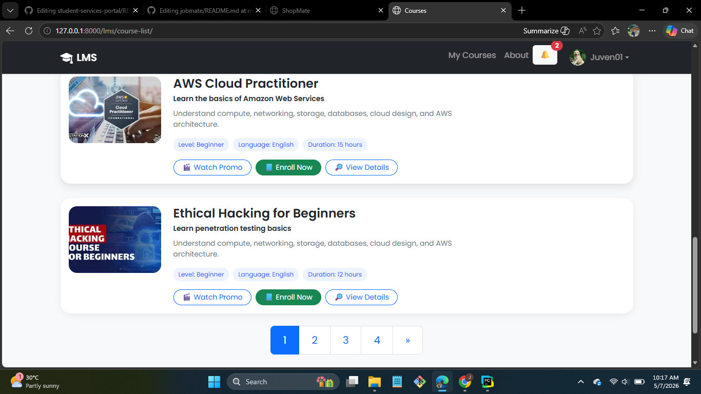
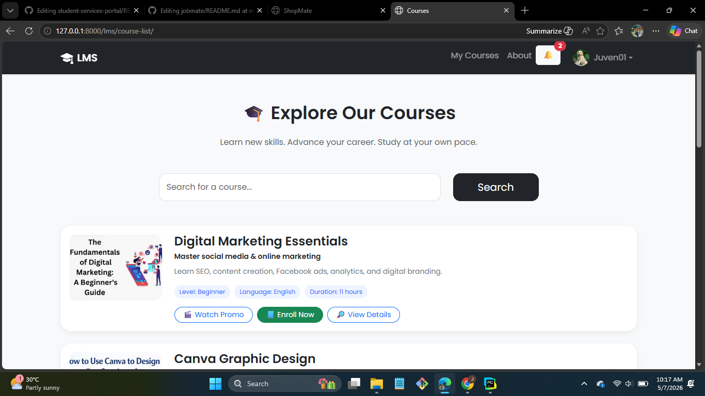

## Teacher dashboard
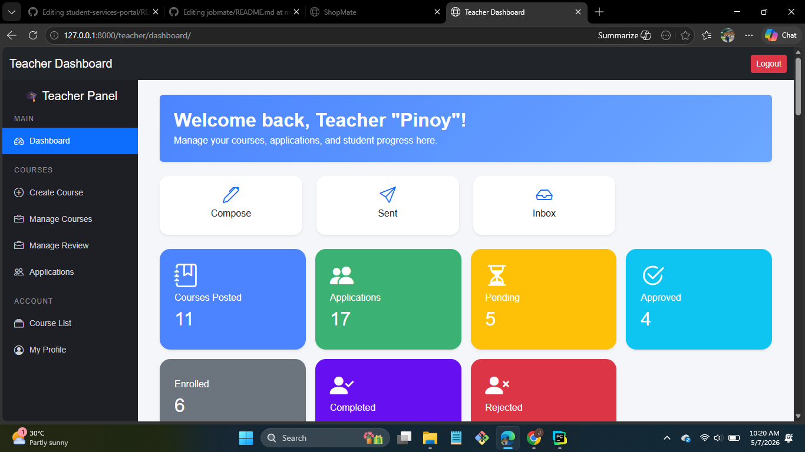
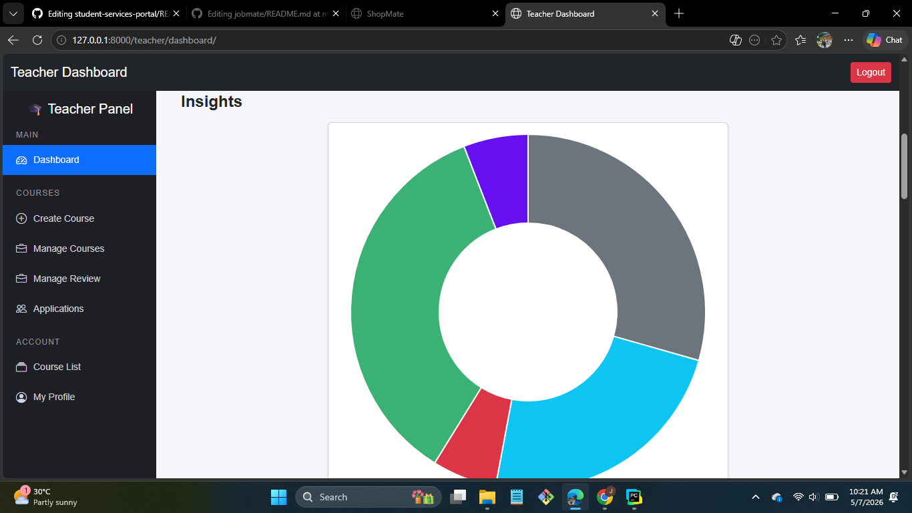
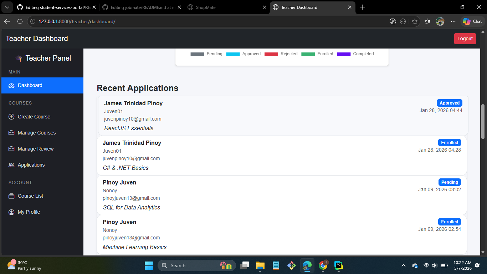
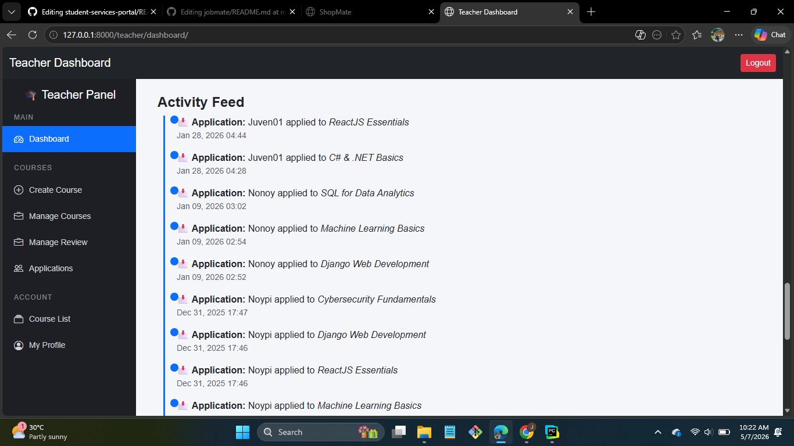

## Admin dashboard
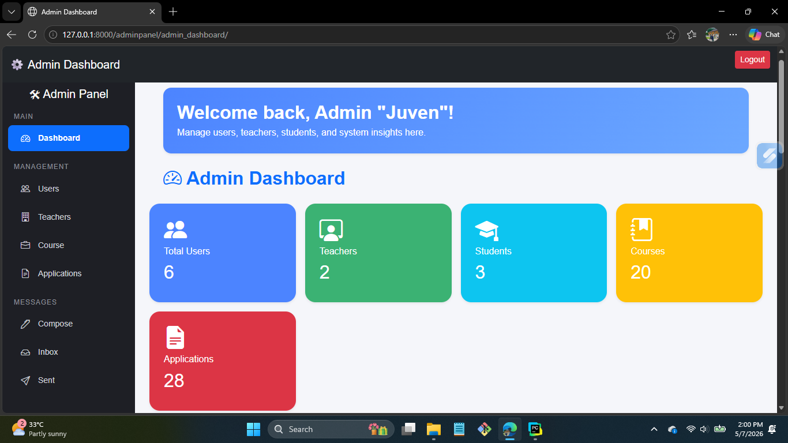
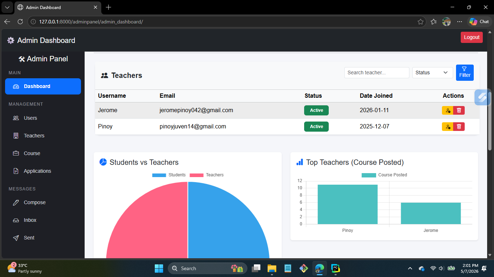
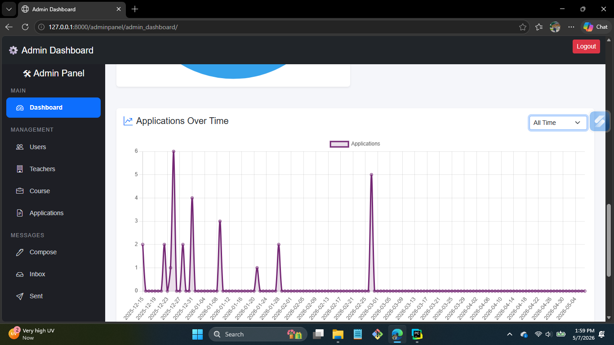
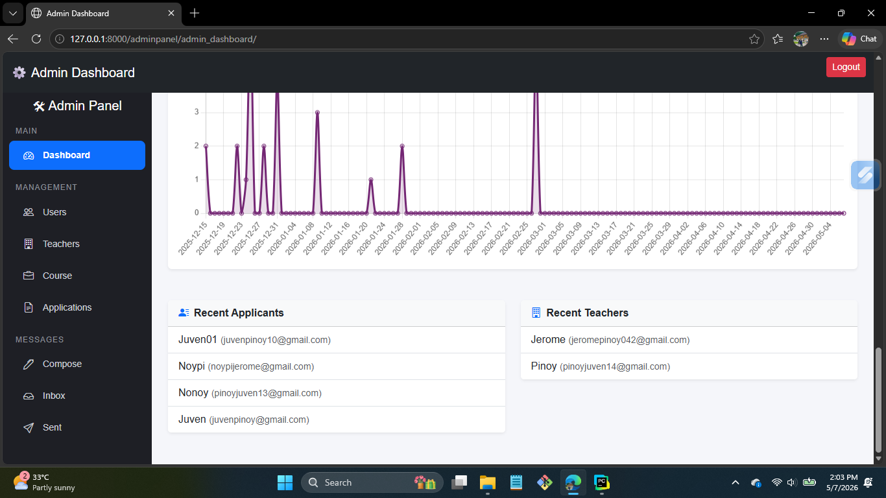

# ⚙️ Installation

```bash
git clone https://github.com/juvpin143/learning-management-system.git
cd learning-management-system
pip install -r requirements.txt
python manage.py runserver
